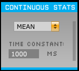

# Continuous Statistics Plugin 

Plugin for the Open Ephys GUI to compute the exponentially weighted sliding mean or standard deviation of incoming continuous data.

## Installing with CMake:

This plugin can now be built outside of the main GUI file tree using CMake. In order to do so, it must be in a sibling directory to plugin-GUI\* and the main GUI must have already been compiled.

You should use this branch if you are already using CMake to build the *cmake GUI* (in development as of writing). Otherwise, use the `old-gui` branch.

See `ContinuousStats/CMAKE_README.txt` and/or the wiki page [here](https://open-ephys.atlassian.net/wiki/spaces/OEW/pages/1259110401/Plugin+CMake+Builds) for build instructions.

\* If you have the GUI built somewhere else, you can specify its location by setting the environment variable `GUI_BASE_DIR` or defining it when calling cmake with the option `-DGUI_BASE_DIR=<location>`.

## Usage:

Use the drop-down box to select mean or standard deviation. The "time constant" controls how rapidly the sliding statistics decay; it
equals how long it takes for the influence of a sample to drop to 1/e of its original value.

Channels can be included/excluded from processing by selecting/deselecting them in the "Param" section the drawer.

## Testing:

There is a test file in "Test" that allows you to compare the output of the plugin to the expected output (as implemented in MATLAB). See its header for more information.
